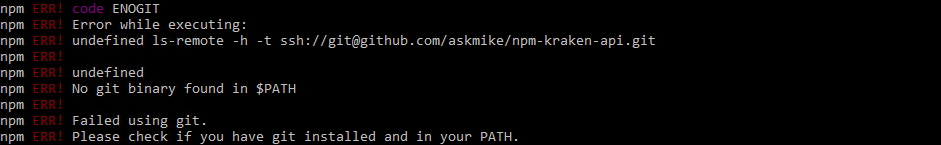

# Gekko FAQ and Knowledge Base

> Gekko is a Bitcoin TA trading and backtesting platform that connects to popular Bitcoin exchanges. It is written in JavaScript and runs on Node.js.
> -- https://github.com/askmike/gekko/

Since recent influx of new users in [Gekko Discord channel](https://discord.gg/EecGYxW), I've decided to collect some commonly asked questions to help new users get started. PRs are welcome.

## Where can I find more strategies?

I heavily suggest reading [my Medium posts](https://medium.com/@deandree) where I backtest and analyze 32 (17 advanced + 15 neural net) strategies, to get a feeling about what can be accomplished with open source strategies, before you start developing your own.


Another resource with backtest results is [xFFFFF repo](https://github.com/xFFFFF/Gekko-Strategies), but it hasn't been updated for a while (2 years). Also, contains ton of strategies, big part of them actually work.

Other strategy sources I've found (all credit to authors):

- https://github.com/PGTBoos/GekkoStrategies
- https://github.com/crypto49er/Gekko-Strategies
- https://github.com/pflima92/my-gekko-strategies
- https://github.com/mutenroch/gekko-PSAR-strategy
- https://github.com/Perpetuus85/gekko-neural-network-strategy
- https://github.com/markchen8717/Gekko_Bot_Trading_Strategies
- https://github.com/vtnplus/gekko-strategies
- https://github.com/R4nd0/Gekko-Strategies
- https://github.com/TeoWay/Gekko-Strategies
- https://github.com/scubix/gekko-strategies
- https://github.com/WildcatKSS/gekko-strategies
- https://github.com/nmikaty/Gekko-Strategies
- https://github.com/Gab0/gekko-adapted-strategies
- https://github.com/RJPGriffin/gekko
- https://github.com/pflima92/my-gekko-strategies
- https://github.com/CyborgDroid/gekkoIndicators
- https://github.com/mono151/pumprider

## Where can I find more indicators?

- https://github.com/anandanand84/technicalindicators/
- https://github.com/thegamecat/gekko-trading-stuff
- https://github.com/CyborgDroid/gekkoIndicators
- https://github.com/Gab0/gekko-extra-indicators
- https://github.com/JasonMatthewsDev/gekkoIndicators

## Can I run Gekko on multiple timeframes (candle sizes)?

Yes, see [this](https://github.com/zappra/gekko/blob/develop/strategies/timeframes.js) and [this](https://github.com/CyborgDroid/gekkoIndicators/tree/master/sampleStrategies) example.
Also, [Green Gekko](https://github.com/mark-sch/gekko) supports multiple timeframes.

## Installation Issues

### Exchanges dropdown empty in UI


You have not installed Gekko Broker's dependencies, see [here](https://gekko.wizb.it/docs/installation/installing_gekko.html#Installing-Gekko-39-s-dependencies)

```cd exchange
npm install --only=production
```

### sqlite3 install errors

`Failed to execute '/usr/local/bin/node /usr/local/lib/node_modules/npm/node_modules/node-gyp/bin/node-gyp.js configure --fallback-to-build --module=/Users/Giolivio/gekko/node_modules/sqlite3/lib/binding/node-v72-darwin-x64/node_sqlite3.node --module_name=node_sqlite3 --module_path=/Users/Giolivio/gekko/node_modules/sqlite3/lib/binding/node-v72-darwin-x64' (1)`

Could be problems with node version > 10, downgrade to 10.

```sudo apt-get remove nodejs
curl -sL https://deb.nodesource.com/setup_10.x | sudo bash -
sudo apt-get install nodejs
```

Thanks @giolivio and @ontox for solution.

### ENOGIT / No git binary found in \$PATH



You don't have git installed. Do it.
